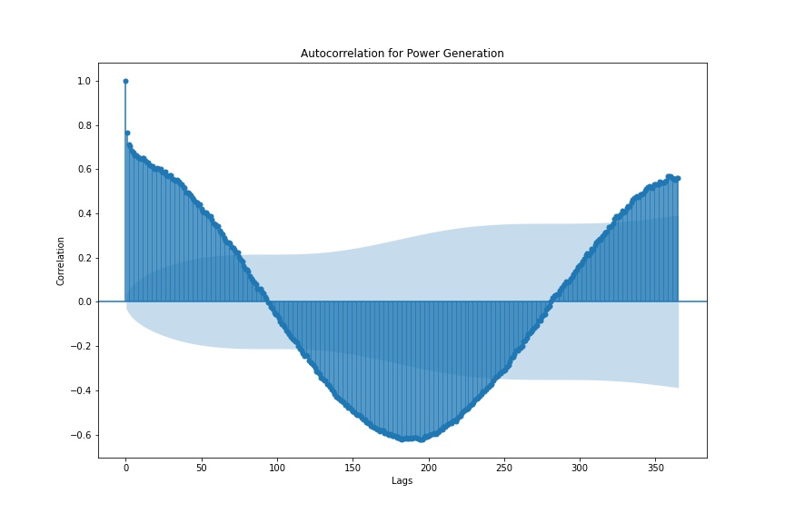
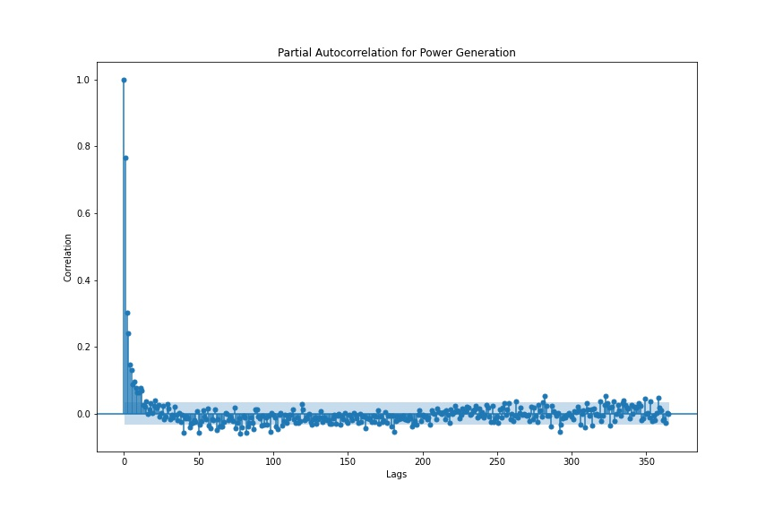

#  Group Project: Predicting Solar Power Generation with Weather Forecasting
By: Garrett Hart, Joseph Hicks, and Corina Lentz

### Problem Statement

Around the world there is a strong push to move away from fossil fuels towards renewable energy. One of the challenges of working with renewable energy is being able to accurately predict how much energy will be produced, to ensure that energy needs will be met. In this project we will create a model that can predict the energy output of a residential solar array located in Antwerp, Belgium.

### Data

The electrical output data from the residential PV system was recorded in kilowatts per hour (kWh) everyday in the early hours of the morning from 2011-10-26 through 2020-11-10 for a total of 3304 observations. The full dataset and additional details can be found on [Kaggle[7]](https://www.kaggle.com/fvcoppen/solarpanelspower) The weather data for Antwerp, Belgium is scraped from [Weather World Online[8]](https://www.worldweatheronline.com/) for the same timeframe using Weather World Online's [API[9]](https://www.worldweatheronline.com/developer/api/docs/historical-weather-api.aspx#qparameter) . 

### Data Dictionary

A detailed dictionary for the weather data can be found [here[9]](https://www.worldweatheronline.com/developer/api/docs/historical-weather-api.aspx#qparameter) .

|***Feature***|***Description***|
|---|---|
|***date***|The date that the observation was made in the Year-Month-Day format|
|***Cummulative_solar_power***|The total solar power generated by the solar array up to that date in kWh.|
|***generated_kWh***|The total solar power generated by the solar array that day in kWh.|
|***lag_1***|The solar power generated the previous day shifted forward to this date, in kWh.|
|***lag_2***|The solar power generated two days before this date shifted forward to this date, kWh.|

### Data Cleaning & Pre-Processing

During cleaning and pre-processing of the PV power dataset we converted the 'date' column from a string to a datetime data type and dropped the first entry since the solar panels might not have been operating the whole day. We used the 'Cumulative_solar_power' column to create a new column for power generated that day called 'generated_kWh'. Then we dropped the 'Cumulative_solar_power', 'kWh electricity/day', and 'Gas/day' columns as they aren't relevant to our project.

With the weather dataset we removed the first entry, since this was done in the PV power dataset. We also convert the 'date' column from string to datetime datatype. Then we merged the two datasets together.

### Exploratory Data Analysis

For EDA we made the 'date' column the index of the merged dataset. Then we plotted the seasonal decomposition of the 'generated_kWh' column over a 365 day period. We found there is a consistent seasonality each year, but no strong trend. When charting the autocorrelation and partial-autocorrelation we found that lag terms would work well in our modeling. We determined that the first two lag terms would work well as features in our models and added them as 'lag_1' and 'lag_2' columns in our merged dataframe. After adding our lag terms we dropped the rows that had NaN values. After that we explored the data to see what weather conditions effect power output the most using .loc and correlation heatmaps. We found the only features that don't have a decent correlation with the amount of power generated are 'precipInches', 'pressureInches', and 'totalSnow_cm'. This makes sense, as these features tend to have constant values throughout the dataset with occasional deviations.

### Modeling

For the modeling portion of this project, we tried out a variety of different regression models, inlcuding a **Random Forest Regressor**, a **Linear Regression model**, **SVM regression model**, and a **Bagging Regressor model**. First we completed our train-test-split with a training set size of 0.8 and a testing set size of 0.2 . We established that our baseline RMSE is 8.4394 and our baseline R Squared is 0.0 .

We started out by building a Random Forest model since they are typically strong predictive models that don’t require much data pre-processing like scaling or normalization. We used a gridsearch to determine the best parameters for the Random Forest, then we created a feature importance plot with the best estimator. We had a R Squared score of 0.7828 and a RMSE of 3.8306 on the training data. On the testing data we had a R Squared score of 0.7085 and a RMSE of 4.5562 . Quite a bit of variance between the training and testing, but still an improvement over our baseline model.

We chose a Linear Regression model to use it as an inferential model and as a starting place for more complex models. After fitting our Linear Regression model we had a Training R Squared Score of 0.7192, a Testing R Squared Score of 0.7044, and a overall RMSE of 4.5884. This model had Lower R Squared scores on both the training and testing data, however the variance was dropped a lot and it still performed better than our baseline. In reviewing our coefficients we found that the 'uvIndex', 'precipInches', 'sunHour', 'humidity' and the temperature features had the most impactful coefficients. 

Initially, we chose a SVM Regression model as it is one of the best ways to create a more powerful predictive model (outside of using a neural net, which would not be advisable on such a small dataset). We tuned over the different hyperparameters and used Standard Scaler for our transformer. Unfortunately it struggled to get a score over 0.71 on the testing set, no matter the hyperparameters. For this reason, we decided to try a different model. 

To get around the issues with the SVR model, we ran a model that utilizes bagging to aggregate the decisions of many models over different random sets of the data. This model could make use of the SVR as a base model. We also included the lag term features in this model. We used Standard Scaler to fit_transform our training data and to transform our testing data, then we instantiated our Bagging Regressor with a Decision Tree Regressor as the base estimator. We used gridsearch to tune over our hyperparameters on this model as well. For the Bagging Regression model the Training R Squared Score was 0.7025 and the Testing R Squared Score was 0.7280 .

Overall, the **Bagging Regressor** model had the best Testing R Squared Score and has a good balance of bias versus variance. It is the production model we would recommend at this time.

### Conclusions
We created interpretable Linear Regression and Random Forest models in which we found that sunlight hours, UV index, high temperature, and humidity affect the solar output the most. We then created a Bagging Regressor model that can account for 73% of the variance in our output. We succeeded in creating a model that can take in weather forecasts and previous output data to make predictions on power output. 

### Next Steps
Going forward we would recommend collecting more data from arrays with different climates, latitudes, weather conditions, and different panel technologies to train the models on more varied data. A larger dataset would also allow for trying more robust models, such as a Neural Network, and different variables.

### Resources

1. https://en.wikipedia.org/wiki/Solar_power
2. https://www.energy.gov/eere/solar/solar-photovoltaic-technology-basics
3. https://en.wikipedia.org/wiki/Photovoltaic_system
4. https://www.ysgsolar.com/blog/which-solar-panels-are-best-modules-install-your-home-ysg-solar
5. https://sunshinerenewable.com/s-energy-solar-panels/
6. https://www.climatestotravel.com/climate/belgium/antwerp
7. https://www.kaggle.com/fvcoppen/solarpanelspower
8. https://www.worldweatheronline.com/
9. https://www.worldweatheronline.com/developer/api/docs/historical-weather-api.aspx#qparameter
